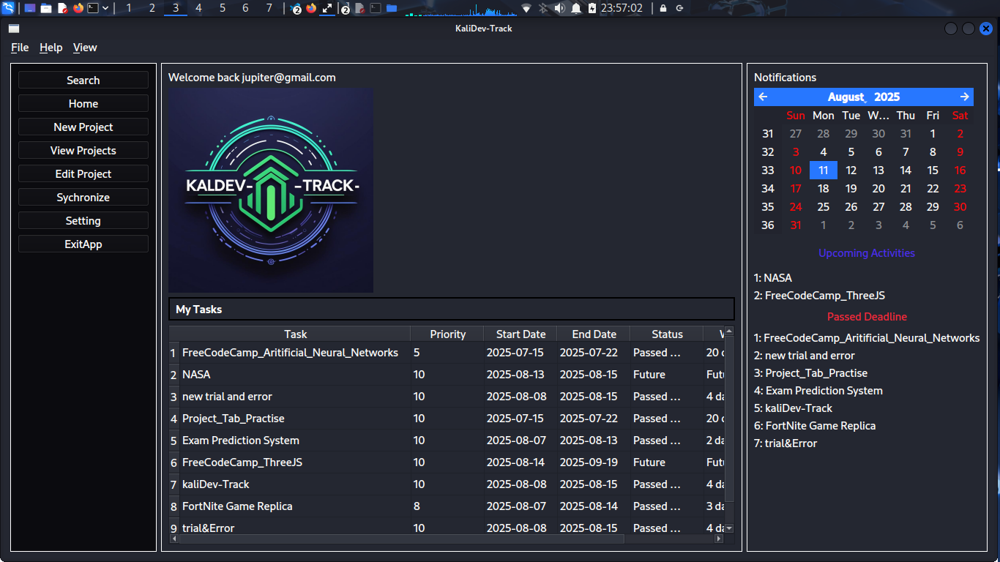

# kALIDEV-TRACK

[](https://wakatime.com/badge/user/ca37100b-7f0f-4ae1-947c-ff595165e688/project/034b45f1-a1e8-420c-9e89-f194d93f4d50)

## Description

**kALIDEV-TRACK** is a desktop application for tracking the progress of your software projects and tasks. Built with PySide6, it provides a user-friendly interface to manage, view, and organize your projects efficiently.



---

## Features

- Create, view, update, and delete projects and tasks
- Track project deadlines and task statuses
- Visualize upcoming and overdue activities
- Data stored in JSON files for easy backup and portability
- Move projects to recycle bin (using `send2trash`)
- Cross-platform support (Linux, Windows, macOS)

---

## Installation

1. **Clone the repository:**
    ```sh
    git clone https://github.com/alsongard/the-project-tracker.git
    cd the-project-tracker
    ```

2. **Install dependencies:**
    ```sh
    pip install -r requirements.txt
    ```

    *Typical dependencies:*
    - PySide6
    - send2trash

3. **Setup MongoDB**  
    setup your mongodb url in an env file for backingup data
---

## Usage

Run the main application:

```sh
python app/main.py
```

You can now create and manage your projects and tasks through the GUI.

---

## Project Structure

```
the-project-tracker/
├── app/
│   ├── createTasks.py
│   ├── fileOperations.py
│   ├── homeTaskView.py
│   └── main.py
├── assets
    └── icons/
├── data/
│   └── userDetails.json
├── README.md
└── requirements.txt
```

---

## Contributing

Pull requests are welcome! For major changes, please open an issue first to discuss what you would like to change.

---

## License

This project is licensed under the GPLv2 License.

---

